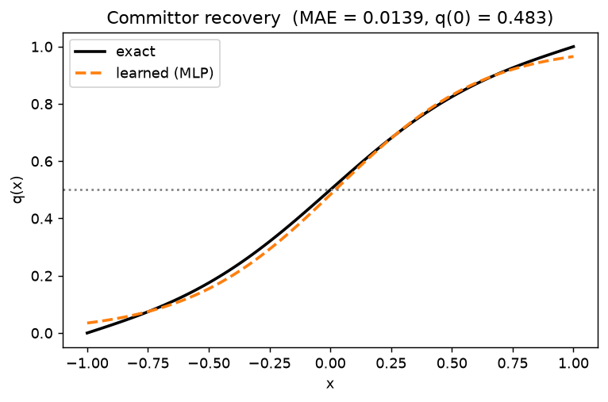
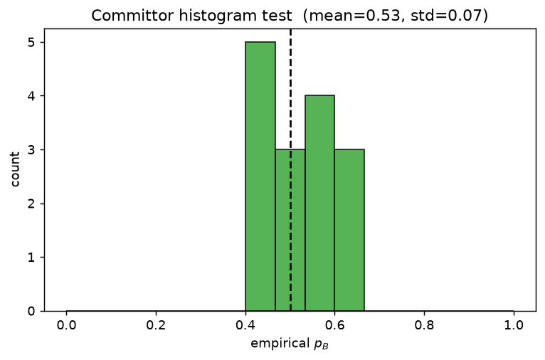
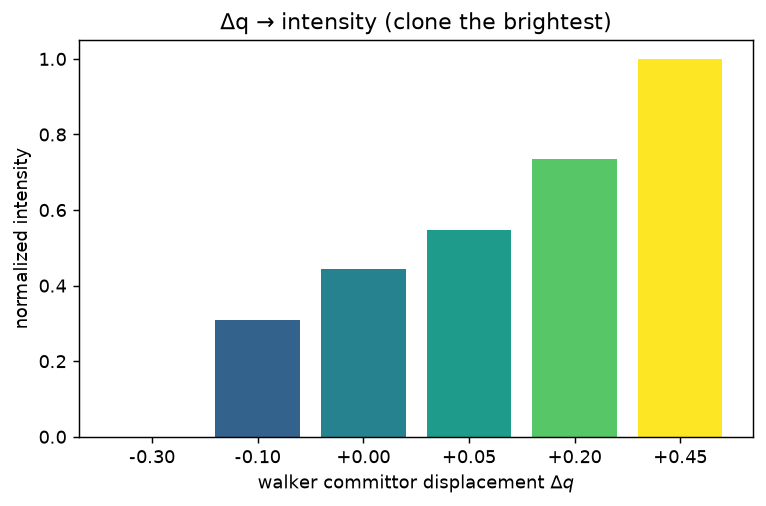
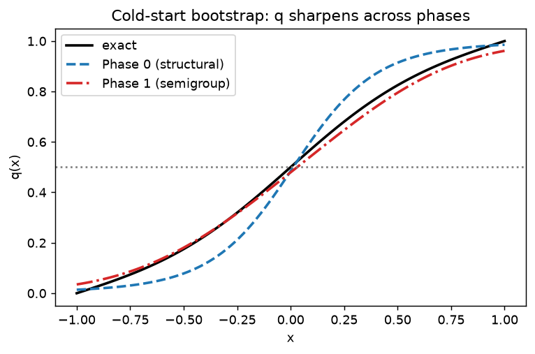

# CoWERA-Committor — Learned Committor as the Resampling Criterion

This document describes the **opt-in** committor extension of CoWERA and the
status of its first milestone (M1). The goal is to replace/augment CoWERA's
sign-based temporal-coherence phase `φ` with a learned **committor**
`q(x) = P(reach B before A | x)` — the provably optimal reaction coordinate
(backward Kolmogorov PDE) — used as the clone/merge criterion.

The full design is captured in the planning documents; this file tracks what is
implemented and how to validate it. The published `cowera/` path is unchanged
and remains the default; the committor lives in a separate subpackage
`Scripts/cowera_committor/` and pulls in no machine-learning dependency unless
explicitly used.

## Why this fits CoWERA cleanly

Mechanically, the committor is just a different progress coordinate
`P(x) = q(x)` feeding the **same** phase→intensity machinery, with the continuous
committor displacement `Δq` replacing the sign-based phase
(`np.sign(np.diff(...))`, which `Δq` strictly generalizes). The performance
refactor (PR #2) already created the seams this reuses:

| Need | Reused seam |
|---|---|
| Per-frame CV series + clone/merge reindex + warp reset | `cowera/cv_history.py::CVHistory` (store `q(x)` per frame) |
| `Δq` → intensity (Eqs. 3–6) | `cowera/metric.py`: `intensity_from_projections`, `scale_phases`, `compute_intensity` |
| Per-frame CV production seam (→ model inference) | `cowera/metric.py::project_new_frames` |
| Clone/merge optimizer + merge proximity | `cowera/resampler.py::decide` (augment merge distance with `|q_i−q_j|`) |
| Reactive (B-touch) detection | `cowera/warper.py::TargetBC._progress` |

Because of this, swapping `φ → Δq` requires **no change** to `decide()`; the
committor path will subclass `Calculate_Distances` / `CoWERAResampler`.

## Milestone M1 (implemented) — committor core

`Scripts/cowera_committor/`:

- **`featurizer.py`** — SE(3)-invariant features. `DistanceFeaturizer` uses
  internal pairwise distances (rotation/translation invariant; reuse
  `cowera.features.get_native_contacts` for the pairs); `IdentityFeaturizer`
  passes toy-system CV coordinates through.
- **`committor_model.py`** — `CommittorModel` interface + `MLPCommittor`, a
  dependency-free MLP with **manual backprop** and Adam. Trained with the
  WE-weighted variational (Dirichlet / semigroup) loss plus boundary and
  optional AIMMD shooting terms:

  ```
  L = w_b [ λ_A <w q²>_A + λ_B <w (1−q)²>_B ]            (boundaries)
    + w_s <w (q(x_t) − q(x_{t+τ}))²>                      (semigroup)
    + w_a (−<w [n_A log(1−q) + n_B log q]>)               (AIMMD)
  ```

  Every term carries the WE walker weight `w` (inverse-probability weighting),
  the subtle correctness point from the cold-start protocol. The output head is
  shaped so a softmax multi-state head (`n_states > 2`) drops in later.

- **`committor_data.py`** — `BoundaryBuffer` (permanent), `SemigroupBuffer` and
  `ShootingBuffer` (sliding window), all WE-weighted.

- **`toy_systems.py`** — analytic validation: symmetric double well
  `V(x)=(x²−1)²`, overdamped Langevin trajectory generator (source of semigroup
  pairs), and the exact 1D committor by quadrature
  `q(x)=∫_a^x e^{βV}/∫_a^b e^{βV}`.

### M1 validation (CPU, no GPU/MD)

`Scripts/tests/test_committor_*.py` (87 tests in the suite total):

- **Finite-difference gradient check** — analytic gradients match numerical
  gradients for all loss terms (guarantees the manual backprop is correct).
- **Double-well committor recovery** — trained on semigroup + boundary data, the
  model reproduces the analytic committor with **MAE ≈ 0.014** (target < 0.02),
  `q(0) ≈ 0.48` (barrier ≈ 0.5), correlation 0.999.
- Featurizer SE(3) invariance; buffer sliding-window / weighting; toy-system
  ground truth (boundary values, symmetry, monotonicity).

Run:
```bash
python -m pytest Scripts/tests/ -v
```

### Tutorial notebook & validation figures

A full, executed walkthrough is in
[`Analysis/CoWERA_Committor_Tutorial.ipynb`](../Analysis/CoWERA_Committor_Tutorial.ipynb)
(needs only `numpy` + `matplotlib`): it builds the benchmark, generates WE-style
training data, trains the committor, validates it, and shows the Δq → intensity
mapping. Generated figures (`docs/figures/`):

**Learned vs. exact committor** — MAE ≈ 0.014:



**Committor histogram test** — empirical $p_B$ from transition-state candidates
clusters at 0.5 (mean ≈ 0.53, std ≈ 0.07), the standard dynamical validation:



**Δq → CoWERA intensity** — committor displacement feeds the production
`scale_phases` / `compute_intensity` path; the brightest (most forward-progressing)
walkers are cloned:



Other figures: `committor_doublewell_system.png`, `committor_training_data.png`,
`committor_loss.png`.

## Milestone M2 (implemented) — Δq resampling path

`Scripts/cowera_committor/committor_metric.py` provides
`CommittorDistances(Calculate_Distances)`, which makes the committor the live
resampling criterion. Because the Phase-2 refactor decoupled the analysis from
the projection source, **this is a drop-in: no change to `resampler.py`**.

- **Projection → q:** `get_proj_coord` / `_load_projection` / `project_new_frames`
  run model inference (`featurizer → model.predict_batch`) so each walker frame's
  committor `q` is produced and stored in the existing `CVHistory` exactly as a
  geometric CV was.
- **Continuous Δq phase:** `phase_from_projection` returns the committor
  displacement `Δq = q(T) − q(T−τ_i)` over the relevant history window (reusing
  `detect_changepoints` + `relevant_change_points`) instead of the sign-based
  phase. The unchanged `intensity_from_projections` / `scale_phases` /
  `compute_intensity` then map `Δq → intensity` (Δq strictly generalizes
  `np.sign(np.diff(...))`).
- **Committor-augmented merge:** `pairwise_distance_matrix` returns
  `D_ij = α·D_RMSD + (1−α)·|q_i − q_j|` (`merge_alpha`, default 0.7), with the
  vector-committor L1 generalization already in `augment_merge_distance`.

Wiring it into CoWERA (sketch):

```python
from cowera_committor import CommittorDistances, MLPCommittor, DistanceFeaturizer
from cowera.resampler import CoWERAResampler

dist = CommittorDistances(committor_model=model, featurizer=feat,
                          increment=1, merge_alpha=0.7,
                          native_file=native_path, top_file=native_path)
resampler = CoWERAResampler(distance=dist, init_state=walker_state,
                            merge_dist=d_merge, increment=1, ...)  # unchanged
```

Pure helpers (`augment_merge_distance`, `committor_displacement`) and the Δq
phase / intensity path are unit-tested with an injected changepoint function and
synthetic committor histories — no ruptures/mdtraj/GPU required
(`Scripts/tests/test_committor_metric.py`).

## Milestone M3 (implemented) — cold-start bootstrap & on-the-fly training

The committor is trained **during** the run from a cold start (no reactive
trajectories). `Scripts/cowera_committor/`:

- **`phase_manager.py`** — `BootstrapPhaseManager`, the cold-start state machine.
  It tracks the phase, decides when to advance (quality/exit criteria), and
  emits the per-phase **loss weights**, **conservative-merge band**, **retrain
  timing**, and **data routing** — all pure-Python and unit-tested.
  - **Phase 0 (structural):** A↔B interpolants (no MD) → coarse `q⁰`;
  - **Phase 1 (semigroup):** variational training on WE segment pairs; conservative
    merges; exit when `var(q)` on intermediates exceeds threshold for N retrains;
  - **Phase 2 (shooting):** AIMMD; exit on the committor histogram test;
  - **Phase 3 (mature):** full guidance, normal merges.
- **`bootstrap.py`** — `structural_interpolants`: linear A↔B interpolants with
  soft labels `y = 1−α` (optional injected relaxation).
- **`committor_train.py`** — `extract_segment_training_data` (per-frame routing to
  boundary / semigroup buffers), `assemble_training_data`, and `retrain_committor`
  (phase-aware loss weights).
- **`committor_metric.py`** — `suppress_tse_merges` implements the conservative
  band (merges involving near-TSE walkers are blocked while `q` is unreliable).
- **`committor_resampler.py`** — `CommittorResampler(CoWERAResampler)`: thin
  orchestration that collects per-cycle training data, retrains on schedule, and
  advances the phase. Plus `config_committor.yml` and `run_cowera_committor.py`.

**Cold-start on the double well** (tutorial §6): `q` sharpens from the coarse
structural seed (Phase 0, MAE ≈ 0.06) to the true committor once dynamical
semigroup data arrives (Phase 1, MAE ≈ 0.02):



The state machine, structural bootstrap, per-frame routing, and end-to-end
retraining are unit-tested (`test_committor_phase_manager.py`,
`test_committor_bootstrap.py`, `test_committor_train.py`). The
`CommittorResampler` glue (which loads frames / featurizes) requires the MD stack
and is validated on the simulation host.

### Earlier four-phase protocol summary
The bootstrap needs **no reactive trajectories**: Phase 0 structural interpolants
→ Phase 1 semigroup on WE segment pairs → Phase 2 shooting-point AIMMD from the
first reactive fragments → Phase 3 mature self-consistent training.

## Statistical validity

On-the-fly committor retraining does **not** bias WE: statistical exactness comes
solely from weight conservation during clone/merge. The resampling criterion
affects **efficiency, not correctness**, so changing it mid-run (as CoWERA
already does for adaptive binning) is valid.

## Roadmap (next milestones)

- **M4 / Phase 2** — shooting-point (AIMMD) augmentation: harvest reactive
  fragments at first B-touch, launch short forward/backward bursts near `q≈0.5`,
  and add the outcomes to the `ShootingBuffer`. Needs the runner CV/burst hook
  (performance Phase 3).
- **M4** — reactive-fragment harvest + shooting interfaces (depends on the
  runner CV/burst hook from performance Phase 3).
- **Stage 2+** — GVP-GNN backend (torch-geometric) behind `CommittorModel`;
  live async retraining; chignolin/Trp-cage benchmarks; FES along `q`;
  multi-state vector/local committor for multi-basin landscapes.
